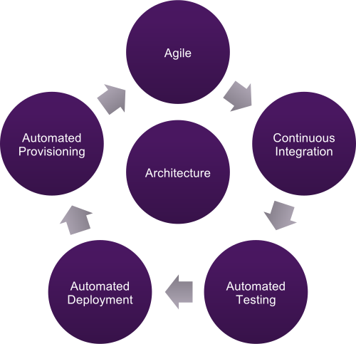

<!-- .slide: data-background="#6B205E" -->
<!-- .element: style="text-align: center" -->
# Continuous Delivery
 
 
 <!-- .element: class="noborder" -->

!SUB
<!-- .element: style="text-align: center" -->
## What's Continuous Delivery?
 <!-- .element: class="noborder" -->

!SUB
<!-- .element: style="text-align: center" -->
## What's Continuous Delivery
Continuous Delivery consists of 5 pillars:
- Agile
  - To continuously work on and deliver (small) increments
- Continuous Integration
  - To continuously build and validate the code
- Automated Testing
  - To continuously validate the functionality of the product
- Automated Deployment
  - To continuously release the product
- Automated Provisioning
  - To automatically create the required infrastructure to run the product(s) on

!SUB
<!-- .element: style="text-align: center" -->
## Why Continuous Delivery?

**faster**

**better**

**cheaper**
