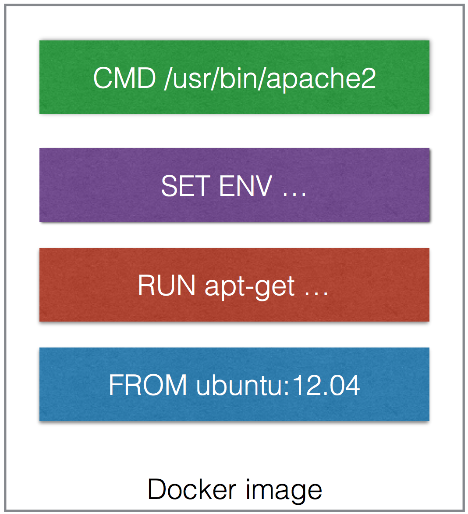
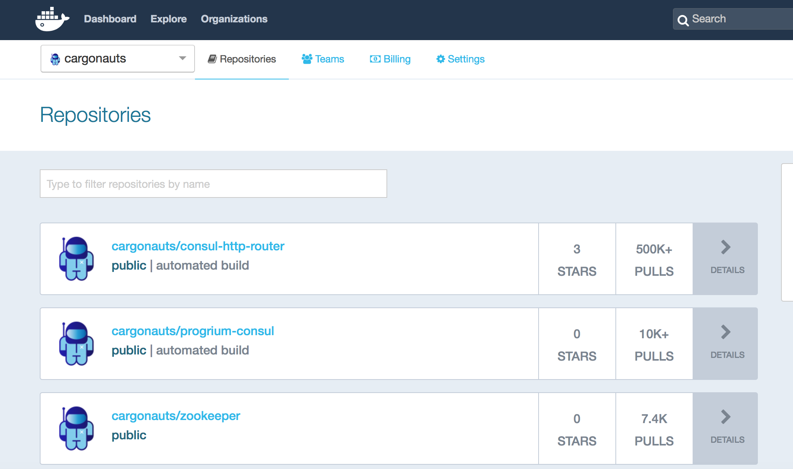

<!-- .slide: data-background="#6B205E" -->
# Build

!SUB
# Workflow
- Get sources
- Compile sources <span class="fragment">in `builder` container</span>
- The container image is the artifact <!-- .element: class="fragment" -->

!SUB
## Creating a Docker image
<center><div style="width: 75%; height: auto;"></div></center>

!SUB
## Dockerfile

```
FROM ubuntu
RUN apt-get update && apt-get install -y apache2 && apt-get clean
ENV APACHE_RUN_USER www-data
ENV APACHE_RUN_GROUP www-data
EXPOSE 80
CMD ["/usr/sbin/apache2", "-D", "FOREGROUND"]
```

!SUB
## Docker Images

<div style="position: absolute; right: 0; top:100; width: 25%; height: auto;"></div>
- contain everything needed to run the app
- are portable across daemons
- have built in layers
  - ordered to actions, Add file, Expose port, Run
- are stored in a Registry

!SUB
## Docker Hub - Image Registry
<div style="position: absolute; right: 0; top:100; width: 40%; height: auto;"></div>
- Contains Docker images
- Public Registry with official images
- Can host your own private Registry

!SUB
# First build
```bash
docker run -ti google/golang bash
```
inside the container:
```bash
cd /gopath
git clone https://github.com/simonvanderveldt/go-hello-world-http /gopath/src
go build go-hello-world-http
exit
```

!SUB
# Create and run image
```bash
docker ps -l
docker commit {CONTAINER ID} go-hello-world-http
docker images #go-hello-world-http image is visible
docker run -d -p 80:80 go-hello-world-http /gopath/go-hello-world-http
```

!SUB
# Does it work?
```bash
curl localhost
> Hello, world!
```

```bash  
# Stop the container
docker kill {CONTAINER ID}
```

!SUB
# Check
What have we done thus far?

What can we improve? <!-- .element: class="fragment" -->

!SUB
# Build using Dockerfile
`go-hello-world-http/Dockerfile`
```dockerfile
FROM google/golang

ENV GOPATH /gopath

WORKDIR /gopath

RUN git clone https://github.com/simonvanderveldt/go-hello-world-http /gopath/src

RUN go build go-hello-world-http
```

!SUB
# Build and run image
```bash
docker build -t go-hello-world-http ./go-hello-world-http
docker run -d -p 80:80 go-hello-world-http /gopath/go-hello-world-http
```

!SUB
# Check
What can we improve?
```
docker images | grep go-hello-world-http
> go-hello-world-http latest d31a90b28d50 2 minutes ago 565.3 MB
```

!SUB
# Getting rid of our build-time tools
We don't need them during run-time


Solution: 2 Dockerfiles <!-- .element: class="fragment" -->

- Generic builder <!-- .element: class="fragment" -->
- Application <!-- .element: class="fragment" -->

!SUB
## Generic builder
`builder/Dockerfile`
```dockerfile
FROM google/golang

ENV GOPATH /gopath

WORKDIR /gopath

ENTRYPOINT ["go", "build"]

CMD ["."]
```

```
docker build -t builder ./builder
```

!SUB
# Build the application
```bash
git clone https://github.com/simonvanderveldt/go-hello-world-http /home/docker/cd-with-docker/go-hello-world-http-v2/src
docker run --rm --volume /home/docker/cd-with-docker/go-hello-world-http-v2/:/gopath builder go-hello-world-http
```
Build artifact is now available at

`/home/docker/cd-with-docker/go-hello-world-http-v2`

!SUB
# Application
`go-hello-world-http-v2/Dockerfile`
```dockerfile
FROM busybox:ubuntu-14.04

EXPOSE 80

ADD go-hello-world-http /go-hello-world-http

ENTRYPOINT /go-hello-world-http
```
```bash
docker build -t go-hello-world-http-v2 ./go-hello-world-http-v2
docker run -d -p 80:80 --name go-hello-world-http-v2 go-hello-world-http-v2
```

!SUB
# Result
```
docker images | grep hello-world-http-v2
> go-hello-world-http-v2 latest 903b479cd26c 2 minutes ago 11.3 MB
```
