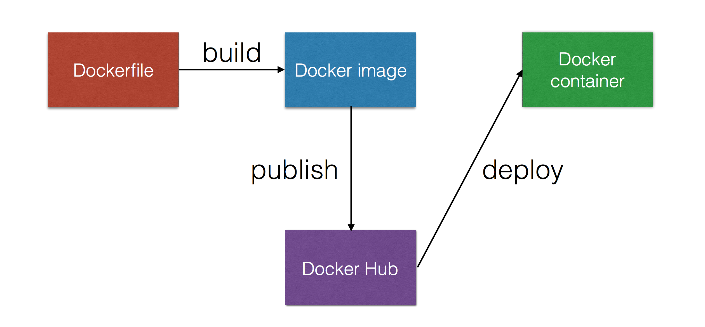

# Continuous Delivery
with
# Docker

!NOTE
No unit tests (for now)
No deployment to production (for now)

!SUB
Explain why Docker is a good fit for Continuous Delivery

# Docker advantages
for
# Continuous Delivery

!SUB
## Faster
- Slow one-time events happen only once on _image_ creation, not on _instance_ creation
- Creating instances is fast/cheap

!NOTE
One-time example initialisation of the app has to happen just once. Fort example for test and production, same artifact is started which had it's initialization done @ build time

!SUB
## Better
- Same images used for development and production
- Isolation
- Consistent and reproducible results
- Portable/host-independent
- Scalability

!SUB
## And more:
- Encourages collaboration between Dev and Ops
- Version control of your Docker images
- Share your images using the Docker Hub

!SUB
Explain how/where we're going to use Docker to create a CD pipeline

!SUB
Exercises to create parts of the pipeline here?

!SUB
Exercises to create a complete pipeline here?

# Continuous Delivery Pipeline
with

 <!-- .element: class="noborder" -->
