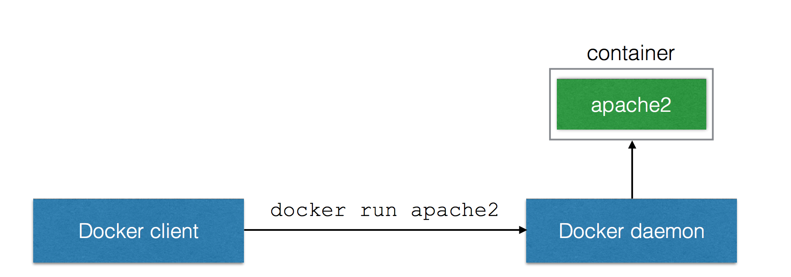

 <!-- .element: class="noborder" -->

!SUB
## What is Docker?
Docker is an open platform for developers and sysadmins to build, ship, and run distributed applications.

_[docker.com](https://www.docker.com)_

!SUB
## Docker features

- Docker engine
- Dockerfiles
- Docker hub


!SUB
## Why Docker?


!SLIDE
## Docker intro exercises here?

!SUB
## Docker has taken the world by Storm!

- 400.000.000 downloads
- 300.000+ Dockerized applications
- 50.000+ third party projects on Github
- 150.000.000 dollar in funding

!SUB
## Why? It Supports True DevOps!
<center><div style="width: 75%; height: auto;"></div></center>


!SUB
## Separation of Concerns
<center><div style="width: 75%; height: auto;"></div></center>


!SUB
## Docker, the goodies

You get all the goodies of virtual machine per appliance, but without the cost.

- Filesystem isolation
- Resource isolation
- Network isolation

And it is fast!


!SUB
## What is Docker?

- Container management for Linux
- Abstraction for DevOps workflow
- Adds images, image repository and version control to containers

!SUB
## Basic Components
<center><div style="width: 75%; height: auto;"></div></center>


!SUB
## Creating a Docker image
<center><div style="width: 75%; height: auto;"></div></center>

!SUB
## Dockerfile

```
FROM ubuntu
RUN apt-get update && apt-get install -y apache2 && apt-get clean
ENV APACHE_RUN_USER www-data
ENV APACHE_RUN_GROUP www-data
EXPOSE 80
CMD ["/usr/sbin/apache2", "-D", "FOREGROUND"]
```

!SUB
## Docker Images

<div style="position: absolute; right: 0; top:100; width: 25%; height: auto;"></div>
- contain everything needed to run the app
- are portable across daemons
- have built in layers
  - ordered to actions, Add file, Expose port, Run
- are stored in a Registry


!SUB
## Docker Hub - Image Registry
<div style="position: absolute; right: 0; top:100; width: 40%; height: auto;"></div>
- Contains Docker images
- Public Registry with official images
- Can host your own private Registry

!SUB
## Running a container
<center><div style="width: 75%; height: auto;"></div></center>
